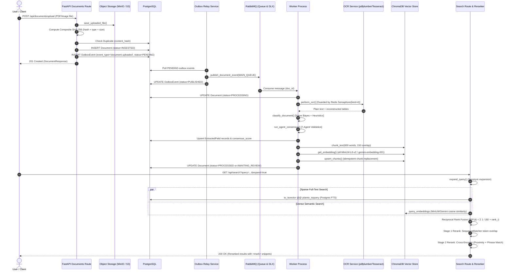
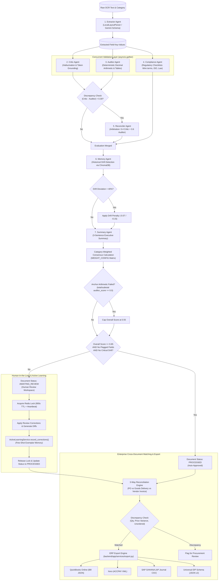
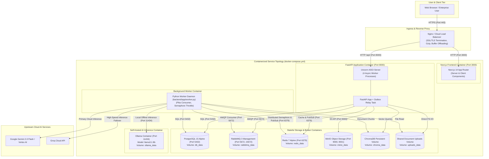

# DocIntel AI — Architecture & Technical Specifications

> **Platform**: DocIntel AI (`AadityaUniyal/Googi`)  
> **Classification**: Enterprise Distributed AI Document Intelligence, Multi-Agent Consensus & Continuous Verification Platform  
> **Document Version**: 2.0.0 (Production Architecture Reference)  
> **Status**: Approved & Verified  

---

## Table of Contents

1. [Executive Summary](#1-executive-summary)
2. [System Architecture & Component Interactions](#2-system-architecture--component-interactions)
   - [2.1 Architecture Diagram](#21-architecture-diagram)
   - [2.2 Core Component Responsibilities](#22-core-component-responsibilities)
   - [2.3 Transactional Outbox Event Relay](#23-transactional-outbox-event-relay)
3. [Document Ingestion, Processing & Hybrid Retrieval](#3-document-ingestion-processing--hybrid-retrieval)
   - [3.1 Ingestion & Retrieval Sequence Diagram](#31-ingestion--retrieval-sequence-diagram)
   - [3.2 Multi-Stage Ingestion Pipeline](#32-multi-stage-ingestion-pipeline)
   - [3.3 PDF Parsing, OCR & Layout Extraction](#33-pdf-parsing-ocr--layout-extraction)
   - [3.4 Chunking & ChromaDB Vector Store](#34-chunking--chromadb-vector-store)
   - [3.5 Hybrid Search & Dual-Stage Reranking](#35-hybrid-search--dual-stage-reranking)
4. [Multi-Agent Consensus & Cross-Document Reconciliation](#4-multi-agent-consensus--cross-document-reconciliation)
   - [4.1 Multi-Agent Pipeline Diagram](#41-multi-agent-pipeline-diagram)
   - [4.2 7-Agent Verification Circle](#42-7-agent-verification-circle)
   - [4.3 Reflexive Debate Engine (Graph-of-Thoughts)](#43-reflexive-debate-engine-graph-of-thoughts)
   - [4.4 Category Weight Matrix & Decision Thresholds](#44-category-weight-matrix--decision-thresholds)
   - [4.5 Three-Way Cross-Document Reconciliation](#45-three-way-cross-document-reconciliation)
   - [4.6 Spatial Bounding Grounding Canvas](#46-spatial-bounding-grounding-canvas)
   - [4.7 ERP & Accounting Export Integration](#47-erp--accounting-export-integration)
5. [Deployment & Infrastructure Topology](#5-deployment--infrastructure-topology)
   - [5.1 Deployment Topology Diagram](#51-deployment-topology-diagram)
   - [5.2 Docker Compose Service Topology](#52-docker-compose-service-topology)
   - [5.3 Kubernetes Cluster Architecture (`k8s/`)](#53-kubernetes-cluster-architecture-k8s)
   - [5.4 Health Probes & Prometheus Observability](#54-health-probes--prometheus-observability)
6. [Data Models & Schema Architecture](#6-data-models--schema-architecture)
   - [6.1 Relational Entity Models (SQLAlchemy 2.0)](#61-relational-entity-models-sqlalchemy-20)
   - [6.2 Outbox & Inbox Event Models](#62-outbox--inbox-event-models)
7. [Finite State Machines & Lifecycle Governance](#7-finite-state-machines--lifecycle-governance)
   - [7.1 Document Lifecycle State Machine](#71-document-lifecycle-state-machine)
   - [7.2 Distributed Lock Lifecycle](#72-distributed-lock-lifecycle)
8. [API Contracts & Protocols](#8-api-contracts--protocols)
   - [8.1 REST API Route Specifications](#81-rest-api-route-specifications)
   - [8.2 Server-Sent Events (SSE) Protocol](#82-server-sent-events-sse-protocol)
9. [Mathematical Formulations & Algorithmic Rigor](#9-mathematical-formulations--algorithmic-rigor)
   - [9.1 Reciprocal Rank Fusion (RRF)](#91-reciprocal-rank-fusion-rrf)
   - [9.2 Two-Stage Neural Cross-Encoder Reranking](#92-two-stage-neural-cross-encoder-reranking)
   - [9.3 Auditor Graduated Arithmetical Delta & Line Item Math](#93-auditor-graduated-arithmetical-delta--line-item-math)
   - [9.4 Memory Agent Vendor Historical Drift Detection](#94-memory-agent-vendor-historical-drift-detection)
10. [Security, Privacy & Zero-Trust Governance](#10-security-privacy--zero-trust-governance)

---

## 1. Executive Summary

In enterprise accounts payable, procurement operations, and legal compliance, manual document inspection is cost-prohibitive, bottlenecked, and prone to severe operational liabilities. A transposed decimal on an invoice, an unverified shipping surcharge, or a non-compliant governing law clause in a Master Services Agreement (MSA) introduces significant risk.

Conventional single-pass Large Language Models (LLMs) suffer from arithmetical hallucinations, context drift, and an inability to perform verifiable spatial audits against original source pixels. **DocIntel AI (Googi)** resolves these systemic flaws by implementing an **adversarial multi-agent consensus architecture** paired with **deterministic mathematical auditing**, **spatial visual grounding**, and **hybrid dense-sparse retrieval**.

### Architectural Pillars
- **Adversarial Multi-Agent Circle**: Rather than trusting a solitary generative model, extraction hypotheses are evaluated concurrently by specialized micro-agents: *Extractor*, *Critic*, *Auditor*, *Compliance*, *Reconciler*, *Memory*, and *Summary*. Contested fields trigger multi-turn reflexive debates modeled as a Graph-of-Thoughts.
- **Deterministic Decimal Arithmetic**: Financial calculations bypass floating-point imprecision using Python `Decimal` across both US (`$1,234.50`) and European (`1.234,50 €`) notation systems, evaluating subtotal, tax, shipping, and tabular line-item multiplications ($\text{Qty} \times \text{Unit Price} == \text{Total}$).
- **Guaranteed At-Least-Once Delivery**: Built on the Transactional Outbox Pattern, decoupling synchronous HTTP ingestion from background queue processing to ensure zero message loss even during broker outages.
- **Hybrid Dense-Sparse RAG**: Combines PostgreSQL Full-Text Search (sparse BM25/tsvector) with ChromaDB vector embeddings (dense MiniLM/Gemini), fused via Reciprocal Rank Fusion ($k=60$) and two-stage cross-encoder neural reranking.
- **Enterprise 3-Way Reconciliation**: Automatically correlates Purchase Orders (PO), Goods Delivery Notes (DN), and Vendor Invoices down to the line-item level with price/quantity variance detection and direct export to QuickBooks, Xero, SAP S/4HANA, and Universal IDP JSON.
- **Zero-Trust Data Protection**: Luhn algorithm credit card validation and ISO 7064 Mod-97-10 IBAN validation redact sensitive PII/PHI prior to vector persistence.

---

## 2. System Architecture & Component Interactions

### 2.1 Architecture Diagram

```mermaid
graph TB
    subgraph Frontend ["Frontend Layer (Next.js 14)"]
        UI["React SPA & Tailwind CSS"]
        API_CLIENT["Typed API Client (frontend/src/lib/api.ts)"]
        SSE_CLIENT["EventSource SSE / Streaming Consumer"]
        UI --> API_CLIENT
        UI --> SSE_CLIENT
    end

    subgraph Gateway ["API & Edge Gateway"]
        FASTAPI["FastAPI Application (backend/app/main.py)"]
        MIDDLEWARE["Middleware Pipeline<br/>(TraceID, SecurityHeaders, CORS, SlowAPI)"]
        FASTAPI --- MIDDLEWARE
    end

    subgraph StorageBroker ["State, Storage & Message Brokers"]
        PG[("PostgreSQL 15<br/>(Multi-Tenant Relational DB)")]
        REDIS[("Redis 7<br/>(Cache, Locks, Semaphores, Pub/Sub)")]
        RABBIT[("RabbitMQ 3<br/>(Durable Queues & DLX)")]
        CHROMA[("ChromaDB<br/>(Persistent Vector Store)")]
        MINIO[("MinIO / S3 / Local Disk<br/>(Object Document Storage)")]
    end

    subgraph BackgroundServices ["Async & Worker Services"]
        OUTBOX["Transactional Outbox Relay Loop<br/>(backend/app/services/outbox_relay.py)"]
        WORKER["RabbitMQ Worker Daemon<br/>(backend/app/worker.py)"]
        OCR_ENGINE["OCR & Layout Engine<br/>(pdfplumber / Tesseract)"]
        AGENT_CONSENSUS["Multi-Agent Consensus Pipeline<br/>(backend/app/agents/consensus.py)"]
    end

    subgraph ExternalAI ["Inference Providers"]
        GEMINI["Google Gemini 2.0 Flash / Vertex AI"]
        GROQ["Groq Llama-3.3-70b-versatile"]
        OLLAMA["Local Ollama Llama 3.1:8b"]
    end

    %% Communications
    API_CLIENT -->|"REST HTTP / Cookies / JWT"| FASTAPI
    SSE_CLIENT -->|"SSE GET /api/streaming/.../stream"| FASTAPI
    FASTAPI -->|"Read/Write (ORM/Alembic)"| PG
    FASTAPI -->|"Cache & Rate Limiting"| REDIS
    FASTAPI -->|"Outbox Events (PENDING)"| PG
    FASTAPI -->|"Storage PUT / GET"| MINIO
    FASTAPI -->|"Hybrid Search Query"| CHROMA

    OUTBOX -->|"Poll PENDING Events"| PG
    OUTBOX -->|"Publish AMQP Persistent Messages"| RABBIT
    OUTBOX -.->|"Mark PUBLISHED"| PG

    RABBIT -->|"Consume document_processing_queue"| WORKER
    WORKER -->|"Acquire Concurrency Semaphore"| REDIS
    WORKER -->|"Download Artifact"| MINIO
    WORKER -->|"Extract Text & Tables"| OCR_ENGINE
    WORKER -->|"Execute 7-Agent Evaluation"| AGENT_CONSENSUS
    AGENT_CONSENSUS -->|"Provider Fallback Chain"| GEMINI
    AGENT_CONSENSUS -->|"High-Speed Failover"| GROQ
    AGENT_CONSENSUS -->|"Offline Fallback"| OLLAMA
    WORKER -->|"Index 600-word Chunks"| CHROMA
    WORKER -->|"Publish Stage Events (Pub/Sub)"| REDIS
    REDIS -->|"Stream SSE Updates"| FASTAPI
    WORKER -->|"Save Extracted Fields & Audit Logs"| PG
```



### 2.2 Core Component Responsibilities

1. **FastAPI Application Gateway (`backend/app/main.py`)**:
   - Manages HTTP request lifecycles, authentication, and endpoint authorization.
   - Enforces an OWASP-compliant middleware pipeline:
     1. `SecurityHeadersMiddleware`: Sets strict Content Security Policy, `X-Frame-Options: DENY`, `X-Content-Type-Options: nosniff`, and `Strict-Transport-Security`.
     2. `TraceIDMiddleware`: Enforces distributed tracing via `X-Trace-ID` and exports latency metrics.
     3. `CORSMiddleware`: Restricts origins to trusted frontends (`localhost:3000` or production Vercel domains).
     4. `SlowAPIMiddleware`: Enforces token-bucket rate limits per user/IP using Redis.
2. **RabbitMQ Worker Daemon (`backend/app/worker.py`)**:
   - Standalone async process executing message consumption across three durable queues:
     - `document_processing_queue` (`MAIN_QUEUE`): Handles OCR, document classification, multi-agent evaluation, and vector indexing.
     - `crawl_queue` (`CRAWL_QUEUE`): Coordinates distributed asynchronous page fetches and PageRank recalculation.
     - `webhook_queue`: Dispatches HMAC-SHA256 signed outbound webhooks.
   - Dead Letter Exchange (`DLX_EXCHANGE = "document_dlx"`) and Queue (`DLQ_QUEUE = "document_processing_dlq"`) configured with a 24-hour TTL (`x-message-ttl: 86400000`).
   - Exponential retry backoff: $\min(2^{\text{retry\_count}}, 60)$ seconds up to `MAX_RETRIES = 3`.
3. **Redis Caching & Concurrency Broker (`backend/app/services/cache.py`)**:
   - Distributed OCR Semaphore: `acquire_redis_semaphore("ocr", limit=4, timeout=120)` throttles concurrent PDF processing to prevent CPU/memory saturation.
   - Distributed Lock Manager: `SET NX EX` locks with 900-second TTL and atomic Lua script renewal for human review workspaces.
   - Server-Sent Events (SSE) Pub/Sub message broker on channel `doc:pipeline:{document_id}`.
4. **PostgreSQL Relational Store (`backend/app/database.py`)**:
   - Multi-tenant relational persistence with `pool_size=10`, `max_overflow=20`, and `pool_pre_ping=True`.
   - Native UUID support via custom `GUID` TypeDecorator (compatible with PostgreSQL native UUID and SQLite `CHAR(36)`).
5. **ChromaDB Vector Store (`backend/app/services/vector_store.py`)**:
   - Persistent vector collection `"document_intelligence"` indexing 384-dimensional dense vectors (`all-MiniLM-L6-v2`) or 768-dimensional cloud embeddings (`gemini-embedding-001`).

### 2.3 Transactional Outbox Event Relay

To guarantee at-least-once message delivery without distributed 2-phase commits, DocIntel AI employs the **Transactional Outbox Pattern** (`backend/app/services/outbox_relay.py`):

1. **Atomic Write**: Ingestion endpoints record both the business entity (`Document`) and an event record (`OutboxEvent` with status `PENDING`) inside a single atomic database transaction.
2. **Asynchronous Dispatch**: The background outbox loop (`run_outbox_relay_loop`) periodically queries `PENDING` events (batch size: 50, polling interval: 2.0s) and publishes them to RabbitMQ with persistent delivery mode (`delivery_mode=2`).
3. **Mark Published**: Upon successful broker acknowledgment, the event status is updated to `PUBLISHED`. If the broker is unreachable, events remain `PENDING` and are re-attempted on the next tick.
4. **Idempotent Ingestion**: Workers record incoming message identifiers in `inbox_events` (`is_inbox_message_processed`) to prevent redundant processing during message re-delivery.

---

## 3. Document Ingestion, Processing & Hybrid Retrieval

### 3.1 Ingestion & Retrieval Sequence Diagram



### 3.2 Multi-Stage Ingestion Pipeline

1. **Ingestion Endpoints**:
   - Single Upload: `POST /api/documents/upload`
   - Batch Upload: `POST /api/documents/batch-upload` (correlation `batch_id`)
   - Direct JSON Creation: `POST /api/documents/`
   - Automated IMAP Ingestion: `backend/app/services/email_ingest.py`
2. **Cryptographic Deduplication**:
   - Calculates raw SHA-256 digest of file payload.
   - Derives a tenant-scoped composite content hash:
     $$\text{CompositeHash} = \text{SHA256}(\text{RawHash} \mathbin{\Vert} \text{FileType} \mathbin{\Vert} \text{SizeBytes})$$
   - Queries `Document` by `content_hash` and `organization_id`. On cache hits, unlinks the transient upload and returns the existing document with HTTP 200.

### 3.3 PDF Parsing, OCR & Layout Extraction

- **Engine Orchestration (`backend/app/services/ocr.py`)**:
  - **Vector PDFs**: Extracted via `pdfplumber`, reconstructing tabular structures into markdown pipe-delimiters (`| cell1 | cell2 |`) and harvesting word-level coordinates `[x0, top, x1, bottom]`.
  - **Scanned Images (PNG, JPG, TIFF)**: Processed via `pytesseract` with layout-aware Page Segmentation Modes (PSM).
  - **Plain Text (TXT)**: Direct UTF-8 stream decoding.
- **Concurrency Limiting**:
  - Worker invocations acquire a Redis distributed semaphore (`limit=4`, `timeout=120s`) to prevent CPU exhaustion.
  - In-process execution is delegated to an isolated `ThreadPoolExecutor(max_workers=4)`.

### 3.4 Chunking & ChromaDB Vector Store

- **Sentence-Aware Window Chunking (`chunk_text`)**:
  - Regex sentence boundary splitting: `(?<=[.!?])\s+`.
  - Window parameters: Target chunk size = 600 words; backward context overlap = 150 words.
- **Idempotent Upsert Strategy**:
  - Before upserting new chunks, executes an explicit deletion `coll.delete(where={"document_id": str(document_id)})` to purge legacy vectors before inserting `{document_id}_chunk_{idx}` items.
- **Metadata Attachments**:
  - Chunks include `document_id`, `chunk_index`, `pipeline_version`, `category`, `status`, and `organization_id` for tenant-scoped filtering.

### 3.5 Hybrid Search & Dual-Stage Reranking

Retrieval executes over two orthogonal indices:
1. **Sparse Lexical Branch**: PostgreSQL Full-Text Search evaluating `to_tsvector('english', Document.ocr_text)` against `plainto_tsquery('english', q)` scored with `ts_rank_cd`. Web crawler results evaluate `CrawledPage` multiplied by PageRank weight: $\text{Score} \cdot (1.0 + 0.5 \cdot \text{PageRank})$.
2. **Dense Semantic Branch**: ChromaDB cosine distance retrieval:
   $$\text{Sim}_{\text{dense}} = 1.0 - \frac{\text{Distance}}{2.0}$$
3. **Reciprocal Rank Fusion**: Merges sparse and dense ranked lists with constant $k=60$.
4. **Two-Stage Cross-Encoder Reranking**:
   - **Stage 1 (Token Overlap Normalization)**: Computes `difflib.SequenceMatcher` ratios across query and document tokens:
     $$\text{Score}_{\text{stage1}} = 0.7 \cdot \text{RRF}_{\text{norm}} + 0.3 \cdot \text{Overlap}_{\text{norm}}$$
   - **Stage 2 (Cross-Encoder Interaction)**: Computes exact phrase matches ($+0.35$), token overlap ($40\%$), and term proximity exponential decay span bonus ($+0.25 \cdot e^{-\text{span}/300}$):
     $$\text{Score}_{\text{final}} = 0.4 \cdot \text{Score}_{\text{stage1}} + 0.6 \cdot \text{Score}_{\text{cross}}$$

---

## 4. Multi-Agent Consensus & Cross-Document Reconciliation

### 4.1 Multi-Agent Pipeline Diagram



### 4.2 7-Agent Verification Circle

1. **Extractor Agent (`backend/app/agents/extractor.py`)**:
   - Executes structural schema extraction based on detected document classification (`INVOICE`, `PURCHASE_ORDER`, `CONTRACT`, `COMPLIANCE`, `RFQ`).
2. **Critic Agent (`backend/app/agents/critic.py`)**:
   - Verifies factual grounding by matching proposed values against raw OCR text tokens.
   - Evaluates numeric equivalence (stripping currency symbols, checking floating-point alignment).
3. **Auditor Agent (`backend/app/agents/auditor.py`)**:
   - Deterministic arithmetic verification using Python `Decimal` across US and European formats.
   - Evaluates: $\text{Subtotal} + \text{Tax} + \text{Shipping} - \text{Discount} == \text{Total Amount}$.
   - Audits line-item tables: $\text{Quantity} \times \text{Unit Price} == \text{Line Total}$.
4. **Compliance Agent (`backend/app/agents/compliance.py`)**:
   - Verifies governing law clauses, temporal validity (effective date precedes expiry), banking wire details, payment terms (Net 30), and certifications (ISO 9001, RoHS, ASTM).
5. **Reconciler Agent (`backend/app/agents/reconciler.py`)**:
   - Automatically activates when $|S_{\text{critic}} - S_{\text{auditor}}| > 0.30$.
   - Resolves conflicts using LLM adjudication or weighted resolution ($0.4 \cdot S_{\text{critic}} + 0.6 \cdot S_{\text{auditor}}$).
6. **Memory Agent (`backend/app/agents/memory.py`)**:
   - Detects statistical pricing and volume drift against historical ChromaDB baseline vectors for the same vendor and category.
7. **Summary Agent (`backend/app/agents/summary.py`)**:
   - Produces a concise 3-sentence executive brief summarizing key entities, totals, and audit flags.

### 4.3 Reflexive Debate Engine (Graph-of-Thoughts)

When agent confidence scores diverge or fall below $0.70$, the pipeline triggers `ReflexiveDebateEngine` (`backend/app/agents/reflexive_debate.py`):
- Cycles up to 3 iterative debate rounds (`max_rounds=3`).
- Roles: `Extractor` (proposes candidate) $\to$ `Critic` (challenges grounding) $\to$ `Auditor` (challenges arithmetic) $\to$ `Adjudicator` (synthesizes consensus).
- Persists debate thought trajectories with statuses: `PROPOSED`, `CHALLENGED`, `ACCEPTED`.

### 4.4 Category Weight Matrix & Decision Thresholds

Consensus weights reflect the operational risks inherent to each document category:

| Category | Critic Weight ($w_c$) | Auditor Weight ($w_a$) | Compliance Weight ($w_{cp}$) |
|---|---|---|---|
| `INVOICE` | 0.30 | **0.50** | 0.20 |
| `PURCHASE_ORDER` | 0.40 | 0.40 | 0.20 |
| `CONTRACT` | 0.30 | 0.10 | **0.60** |
| `COMPLIANCE` | 0.20 | 0.10 | **0.70** |
| `RFQ` | **0.50** | 0.30 | 0.20 |

- **Anchor Rule**: If `total_amount` or `subtotal` receives an `auditor_score == 0.0`, the document's overall confidence is strictly **capped at $0.55$**, forcing manual human review.
- **Auto-Approval Criteria**:
  $$\text{Score}_{\text{overall}} \ge 0.85 \land \text{No FLAGGED Fields} \land \text{No CRITICAL Drift} \implies \text{PROCESSED}$$
  Otherwise $\implies \text{AWAITING\_REVIEW}$ (Routed to Human Review Queue).

### 4.5 Three-Way Cross-Document Reconciliation

The 3-Way Matching Engine (`ThreeWayReconciliationEngine` in `backend/app/services/reconciliation_3way.py`) reconciles document bundles:
1. **Purchase Order (PO)**: Baseline authorization (SKUs, quantities, contracted prices).
2. **Delivery Note (DN)**: Physical receipt (quantities delivered).
3. **Vendor Invoice (INV)**: Billed financials (quantities invoiced, billed rates).

#### Discrepancy Taxonomy
- `MATCHED`: Quantities match across all 3 documents; unit price variance $\le 0.5\%$.
- `PRICE_VARIANCE`: Invoiced price exceeds PO authorized price beyond tolerance.
- `QUANTITY_MISMATCH`: Delivery slip quantity differs from billed quantity.
- `MISSING_DELIVERY`: Invoiced item has no corresponding delivery receipt.
- `UNORDERED_ITEM`: Billed item was not authorized on the original PO.
- `OVERBILLED`: Invoiced quantity strictly exceeds delivered quantity.

### 4.6 Spatial Bounding Grounding Canvas

Extracted values are mapped to exact physical coordinates via `SpatialGroundingEngine` (`backend/app/services/spatial_grounding.py`):
- Word geometries (`[x0, top, x1, bottom]`) are extracted via `pdfplumber`.
- Multi-token phrase matching resolves bounding polygons enclosing the exact textual match.
- Coordinates are stored in `ExtractedField.bounding_box` as `[x0, y0, x1, y1]` with `page_number`.
- Rendered interactively on the frontend HTML5 canvas (`SpatialBoundingCanvas.tsx`).

### 4.7 ERP & Accounting Export Integration

Export formats are generated dynamically via `backend/app/services/export.py`:
- **QuickBooks Online**: Generates valid QuickBooks Bill JSON schema with vendor reference, AP accounts, and `SalesItemLineDetail` line items.
- **Xero**: Generates standard Xero `ACCPAY` XML invoice document with line-item tax and account codes.
- **SAP S/4HANA & NetSuite**: Generates double-entry SAP FI-AP accounting journal CSVs (Debit Operating Expense GL `600100`, Credit Accounts Payable GL `200100`).
- **Universal IDP JSON**: Schema v2.0 containing metadata, bounding boxes, consensus scores, line items, and export audit trails.

---

## 5. Deployment & Infrastructure Topology

### 5.1 Deployment Topology Diagram



### 5.2 Docker Compose Service Topology

The complete platform stack is declared in `docker-compose.yml` comprising 8 coordinated services:

| Service | Image / Build Target | Host Ports | Persistent Volume | Health Check Command |
|---|---|---|---|---|
| `db` | `postgres:15-alpine` | `5432:5432` | `db_data` | `pg_isready -U postgres` |
| `rabbitmq` | `rabbitmq:3-management-alpine` | `5672:5672`, `15672:15672` | `rabbitmq_data` | `rabbitmq-diagnostics -q ping` |
| `redis` | `redis:7-alpine` | `6379:6379` | `redis_data` | `redis-cli ping` |
| `minio` | `minio/minio:latest` | `9000:9000`, `9001:9001` | `minio_data` | `mc ready local` |
| `ollama` | `ollama/ollama:latest` | `11434:11434` | `ollama_data` | `ollama list` |
| `backend` | `./backend/Dockerfile` | `8000:8000` | `uploads_data`, `chroma_data` | Python HTTP probe to `http://localhost:8000/health/live` |
| `worker` | `./backend/Dockerfile.worker` | N/A | `uploads_data`, `chroma_data` | Python daemon process liveness |
| `frontend` | `./frontend/Dockerfile` | `3000:3000` | N/A | `wget --spider http://localhost:3000/` |

### 5.3 Kubernetes Cluster Architecture (`k8s/`)

Production orchestration manifests in `k8s/` provide declarative enterprise clustering:
- `k8s/namespace.yaml`: Establishes the isolated `docintel` namespace.
- `k8s/configmap.yaml` & `k8s/secret.yaml`: Injects connection strings, JWT rotation keys, and AI provider tokens.
- `k8s/backend-deployment.yaml`: Replicated FastAPI application with readiness (`/health/ready`) and liveness (`/health/live`) HTTP probes.
- `k8s/worker-deployment.yaml`: Scalable background workers consuming from RabbitMQ.
- `k8s/hpa-backend.yaml`: Horizontal Pod Autoscaler dynamically scaling backend pods based on 70% CPU / memory utilization targets.
- `k8s/ingress.yaml`: Ingress controller terminating TLS and routing `/` to the Next.js frontend and `/api` to the FastAPI backend.

### 5.4 Health Probes & Prometheus Observability

- **Liveness Probe**: `GET /health/live` (`backend/app/main.py:293`) returns HTTP 200 `{status: "ok"}` for immediate process health.
- **Deep Readiness Probe**: `GET /health/ready` (`backend/app/main.py:305`) evaluates:
  - PostgreSQL connectivity (`SELECT 1`)
  - Redis ping
  - RabbitMQ socket handshake
  - ChromaDB heartbeat (`chroma_client.heartbeat()`)
- **Prometheus Metrics**: `GET /metrics` (`backend/app/main.py:409`) provides Prometheus metrics including request latency percentiles (avg, p50, p95, p99), queue depth (`googi_rabbitmq_queue_depth`), and agent latency gauges (`googi_agent_latency_seconds{agent="..."}`).

---

## 6. Data Models & Schema Architecture

### 6.1 Relational Entity Models (SQLAlchemy 2.0)

- **`Document` (`backend/app/models/document.py`)**:
  - `id`: GUID (Primary Key)
  - `filename`: String(255), Not Null
  - `file_type`: String(32), Enum (`pdf`, `png`, `jpg`, `tiff`, `txt`)
  - `size_bytes`: Integer
  - `content_hash`: String(64), Indexed (Composite SHA-256 for deduplication)
  - `ocr_text`: Text, Indexed via PostgreSQL Full-Text Search (`tsvector`)
  - `category`: String(32), Enum (`INVOICE`, `PURCHASE_ORDER`, `CONTRACT`, `COMPLIANCE`, `RFQ`, `UNKNOWN`)
  - `confidence_score`: Float
  - `status`: String(32), Enum (`INGESTED`, `PROCESSING`, `PROCESSED`, `AWAITING_REVIEW`, `REJECTED`, `ARCHIVED`, `FAILED`)
  - `organization_id`: GUID, Foreign Key to `Organization.id`
  - `user_id`: GUID, Foreign Key to `User.id`
  - `review_notes`: Text, Optional
  - `reviewed_by`: GUID, Optional
  - `reviewed_at`: DateTime(timezone=True), Optional
  - `executive_summary`: Text, Optional
- **`ExtractedField` (`backend/app/models/document.py`)**:
  - `id`: GUID (Primary Key)
  - `document_id`: GUID, Foreign Key to `Document.id`, Cascade Delete
  - `field_name`: String(64), Indexed
  - `field_value`: Text
  - `confidence_score`: Float
  - `bounding_box`: JSON (Coordinates `[x0, y0, x1, y1]`)
  - `page_number`: Integer
  - `critic_score`: Float
  - `auditor_score`: Float
  - `compliance_score`: Float
  - `consensus_score`: Float
  - `status`: String(32), Enum (`CONFIRMED`, `FLAGGED`, `RECONCILED`)
  - `validation_notes`: Text
- **`User` (`backend/app/models/user.py`)**:
  - `id`: GUID (Primary Key)
  - `email`: String(255), Unique, Indexed
  - `hashed_password`: String(255)
  - `full_name`: String(255)
  - `role`: String(32), Enum (`admin`, `auditor`, `reviewer`, `viewer`)
  - `organization_id`: GUID, Foreign Key to `Organization.id`
  - `is_active`: Boolean, Default `True`
  - `is_verified`: Boolean, Default `False`
  - `totp_secret`: String(64), Optional (for 2FA)
  - `totp_enabled`: Boolean, Default `False`
- **`Organization` (`backend/app/models/organization.py`)**:
  - `id`: GUID (Primary Key)
  - `name`: String(255), Not Null
  - `slug`: String(64), Unique, Indexed
  - `api_key_limit`: Integer, Default 5
- **`AuditLog` (`backend/app/models/audit.py`)**:
  - `id`: GUID (Primary Key)
  - `document_id`: GUID, Optional
  - `user_id`: GUID, Optional
  - `action`: String(64), Indexed
  - `details`: JSON
  - `timestamp`: DateTime(timezone=True), Default UTC

### 6.2 Outbox & Inbox Event Models

- **`OutboxEvent` (`backend/app/models/outbox.py`)**:
  - `id`: GUID (Primary Key)
  - `event_type`: String(64), Indexed (`document.uploaded`, `document.reprocess`)
  - `payload`: JSON
  - `status`: String(32), Enum (`PENDING`, `PUBLISHED`, `FAILED`)
  - `retry_count`: Integer, Default 0
  - `last_error`: Text, Optional
  - `created_at`: DateTime(timezone=True)
  - `processed_at`: DateTime(timezone=True), Optional
- **`InboxEvent` (`backend/app/models/outbox.py`)**:
  - `id`: GUID (Primary Key)
  - `message_id`: String(128), Unique, Indexed
  - `event_type`: String(64)
  - `processed_at`: DateTime(timezone=True)

---

## 7. Finite State Machines & Lifecycle Governance

### 7.1 Document Lifecycle State Machine

Implemented in `backend/app/domain/state_machine.py`:

```
                 ┌──────────────┐
                 │   INGESTED   │
                 └──────┬───────┘
                        │ (Queue dispatched & worker started)
                        ▼
                 ┌──────────────┐
     ┌───────────┤  PROCESSING  ├───────────┐
     │           └──────┬───────┘           │
     │ (Fatal Error)    │                   │
     ▼                  │                   ▼
┌──────────┐            │ (Score >= 0.85 &  │ (Score < 0.85 or
│  FAILED  │            │  no flag / drift) │  anchor math failed)
└──────────┘            ▼                   ▼
                 ┌──────────────┐    ┌─────────────────┐
                 │  PROCESSED   │◀───┤ AWAITING_REVIEW │
                 └──────┬───────┘ (Approved)└───────┬─────────┘
                        │                           │ (Rejected)
                        ▼                           ▼
                 ┌──────────────┐            ┌─────────────┐
                 │   ARCHIVED   │            │  REJECTED   │
                 └──────────────┘            └─────────────┘
```

#### Valid State Transitions
1. `INGESTED` $\to$ `PROCESSING`: Worker consumes the AMQP message and commences OCR.
2. `PROCESSING` $\to$ `PROCESSED`: Multi-agent score $\ge 0.85$, all anchor calculations pass, and no critical drift is detected.
3. `PROCESSING` $\to$ `AWAITING_REVIEW`: Multi-agent score $< 0.85$, anchor arithmetic discrepancy detected, or critical memory drift flagged.
4. `PROCESSING` $\to$ `FAILED`: Processing failure after exhausting 3 exponential retries.
5. `AWAITING_REVIEW` $\to$ `PROCESSED`: Human reviewer verifies or corrects fields and commits approval.
6. `AWAITING_REVIEW` $\to$ `REJECTED`: Reviewer rejects document due to unresolvable errors or fraud.
7. `PROCESSED` $\to$ `ARCHIVED`: Document lifecycle retention archival.
8. `*` $\to$ `PROCESSING`: Triggered when an authorized user requests document reprocessing (`POST /api/documents/{id}/reprocess`).

### 7.2 Distributed Lock Lifecycle

In the Human-in-the-Loop review portal, concurrent edits are guarded by Redis distributed locks (`backend/app/routes/review.py`):
1. **Acquire**: Reviewer opens document $\implies$ `POST /api/review/{id}/lock` sets Redis key `doc:lock:{id}` via atomic `SET NX EX` with a 900-second (15-minute) TTL, returning a unique `lock_token`.
2. **Heartbeat**: Frontend sends periodic heartbeats (`POST /api/review/{id}/heartbeat`) renewing the TTL.
3. **Release**: On exit or submission, atomic Lua script verifies token ownership before deleting the key.

---

## 8. API Contracts & Protocols

### 8.1 REST API Route Specifications

#### Authentication (`/api/auth`)
- `POST /api/auth/register`: Register user with role and password entropy scoring.
- `POST /api/auth/login`: Authenticate; issues JWT access (15m) and refresh (7d) tokens in `HttpOnly` secure cookies.
- `POST /api/auth/refresh`: Rotates refresh token and issues a new access token.
- `GET /api/auth/me`: Retrieves current authenticated user profile and permissions.
- `POST /api/auth/2fa/setup` & `/verify`: Provision and activate TOTP 2-factor authentication.
- `POST /api/auth/apikeys`: Generate SHA-256 hashed API keys for programmatic access.

#### Document Ingestion & Management (`/api/documents`)
- `POST /api/documents/upload`: Single file upload (PDF, PNG, JPG, TIFF, TXT).
- `POST /api/documents/batch-upload`: Multipart batch upload returning correlation `batch_id`.
- `GET /api/documents`: Paginated document list with category, status, and search filters.
- `GET /api/documents/{id}`: Detailed document entity including OCR text and consensus scores.
- `POST /api/documents/{id}/reprocess`: Re-queues document into worker pipeline.
- `GET /api/documents/{id}/spatial-layout`: Word-level bounding boxes `[x0, y0, x1, y1]`.
- `GET /api/documents/{id}/export/{format}`: Export document to ERP format (`quickbooks`, `xero`, `sap`, `universal`).

#### Human-in-the-Loop Review (`/api/review`)
- `GET /api/review/queue`: Lists documents with status `AWAITING_REVIEW`.
- `POST /api/review/{id}/lock`: Acquires exclusive review lock (`LOCK_TTL_SECONDS = 900`).
- `POST /api/review/{id}/heartbeat`: Renews lock TTL.
- `POST /api/review/{id}/unlock`: Releases lock.
- `POST /api/review/{id}/submit`: Commits audited field corrections and approves/rejects document.

#### 3-Way Cross-Document Reconciliation (`/api/v1/reconciliation`)
- `POST /api/v1/reconciliation/3way`: Accepts PO, Delivery Slip, and Vendor Invoice IDs; executes line-item matching and discrepancy detection.

#### Hybrid Search & RAG (`/api/search`, `/api/rag`)
- `GET /api/search`: Executes fused sparse + dense hybrid search with facet filters.
- `POST /api/search/semantic`: Vector search against ChromaDB collection.
- `GET /api/search/suggest`: Auto-completion suggestions.
- `POST /api/rag/ask`: Multi-document conversational RAG with citation entailment verification.
- `POST /api/rag/stream`: Token-by-token Server-Sent Events (SSE) streaming RAG.

### 8.2 Server-Sent Events (SSE) Protocol

Real-time pipeline lifecycle updates are streamed to clients via `GET /api/streaming/documents/{id}/stream` (`backend/app/routes/streaming.py`):
```http
HTTP/1.1 200 OK
Content-Type: text/event-stream
Cache-Control: no-cache
Connection: keep-alive

event: pipeline_event
data: {"document_id": "9b1deb4d-3b7d-4bad-9bdd-2b0d7b3dcb6d", "stage": "OCR_EXTRACTION", "progress": 25, "message": "Extracting text and tables via pdfplumber"}

event: pipeline_event
data: {"document_id": "9b1deb4d-3b7d-4bad-9bdd-2b0d7b3dcb6d", "stage": "AGENT_CONSENSUS", "progress": 70, "message": "Executing 7-agent consensus evaluation"}

event: pipeline_event
data: {"document_id": "9b1deb4d-3b7d-4bad-9bdd-2b0d7b3dcb6d", "stage": "COMPLETED", "progress": 100, "status": "PROCESSED", "overall_score": 0.94}
```

---

## 9. Mathematical Formulations & Algorithmic Rigor

### 9.1 Reciprocal Rank Fusion (RRF)

To fuse disparate rank positions from sparse lexical search (PostgreSQL tsvector FTS) and dense vector semantic search (ChromaDB cosine similarity) without score calibration bias, DocIntel AI implements Reciprocal Rank Fusion ($k=60$):

$$\text{RRF}(d) = \sum_{m \in M} \frac{1}{k + \text{rank}_m(d)}$$

Where:
- $M = \{\text{keyword}, \text{crawl}, \text{vector}\}$ is the set of retrieval mechanisms.
- $\text{rank}_m(d) \in \{1, 2, \dots, N\}$ is the 1-based ordinal rank of document $d$ within retriever $m$.
- $k = 60$ is the smoothing constant preventing high-ranking outliers from dominating the fused distribution.

### 9.2 Two-Stage Neural Cross-Encoder Reranking

Following RRF fusion, candidates undergo a two-stage reranking pipeline:

#### Stage 1: Lexical Overlap Fusion
$$\text{Score}_{\text{stage1}}(d) = 0.7 \cdot \text{RRF}_{\text{norm}}(d) + 0.3 \cdot \text{Overlap}_{\text{norm}}(d)$$

Where $\text{Overlap}_{\text{norm}}$ is the `SequenceMatcher` token similarity between the expanded query and the document snippet.

#### Stage 2: Cross-Encoder Proximity Interaction
The cross-encoder score combines token overlap, exact phrase match bonuses, and minimum term span decay:

$$\text{Score}_{\text{cross}}(q, d) = 0.4 \cdot \text{Overlap}(q, d) + 0.35 \cdot \mathbb{I}_{\text{exact\_phrase}}(q, d) + 0.25 \cdot \exp\left(-\frac{\text{span}(q, d)}{300}\right)$$

Where $\text{span}(q, d)$ is the character distance between the first and last matched query term in the text. The final ranking score is computed as:

$$\text{Score}_{\text{final}}(d) = (1 - w) \cdot \text{Score}_{\text{stage1}}(d) + w \cdot \text{Score}_{\text{cross}}(q, d) \quad (w = 0.6)$$

### 9.3 Auditor Graduated Arithmetical Delta & Line Item Math

Financial audit consistency is evaluated using high-precision Python `Decimal` arithmetic. The delta ratio $\Delta$ is defined as:

$$\Delta = \frac{|\text{Subtotal} + \text{Tax} + \text{Shipping} - \text{Discount} - \text{Total}|}{\text{Total}}$$

#### Graduated Scoring Policy:
1. **Absolute Penny Rounding**:
   $$|\text{Total}_{\text{stated}} - \text{Total}_{\text{calculated}}| \le \$0.05 \implies \text{Score} = 1.00$$
2. **Minor Rounding Variance**:
   $$\Delta < 0.5\% \implies \text{Score} = 0.95$$
3. **Moderate Discrepancy**:
   $$0.5\% \le \Delta < 5.0\% \implies \text{Score} = 0.50$$
4. **Critical Arithmetic Failure**:
   $$\Delta \ge 5.0\% \implies \text{Score} = 0.00$$

#### Line Item Tabular Verification:
For each line item row $i \in \{1, \dots, n\}$ in the extracted tabular structure:
$$\text{CalculatedTotal}_i = \text{Quantity}_i \times \text{UnitPrice}_i$$
$$|\text{CalculatedTotal}_i - \text{StatedTotal}_i| \le \$0.02$$
$$\sum_{i=1}^n \text{CalculatedTotal}_i == \text{Subtotal}$$

### 9.4 Memory Agent Vendor Historical Drift Detection

The Memory Agent tracks historical field distributions $(\mu, \sigma)$ for each vendor and category stored in ChromaDB metadata. The relative drift metric $\delta$ is:

$$\delta = \frac{|V_{\text{current}} - \mu_{\text{historical}}|}{\mu_{\text{historical}}}$$

#### Drift Penalty Brackets:
- **Warning Drift** ($\delta \ge 40\%$): Applies a $-0.07$ penalty to the field consensus score.
- **Critical Drift** ($\delta \ge 100\%$): Applies a $-0.15$ penalty to the field consensus score and flags the document for mandatory human review.

---

## 10. Security, Privacy & Zero-Trust Governance

1. **Zero-Trust PII / PHI Redaction**:
   - **Credit Cards**: Validated via the Luhn algorithm ($\sum d_i \equiv 0 \pmod{10}$). Valid card numbers are redacted to `[CREDIT_CARD_REDACTED]` prior to embedding or vector store insertion.
   - **Bank Accounts (IBAN)**: Validated using the ISO 7064 Mod-97-10 checksum ($(\text{IBAN}) \equiv 1 \pmod{97}$). Valid accounts are masked to `[IBAN_REDACTED]`.
   - **SSNs & Tax IDs**: Regex validated and redacted to `[SSN_REDACTED]`.
2. **Multi-Tenant Data Isolation**:
   - Every database query enforces tenant tenancy scoping via `organization_id` filters (`filter_documents_for_user`, `require_document_read`). Cross-tenant data leakage is strictly blocked at the ORM layer.
3. **SSRF Defense Policy**:
   - All outbound webhooks and crawler requests evaluate destination URLs against `validate_safe_url`, blocking private/loopback RFC 1918 CIDR blocks (`10.0.0.0/8`, `172.16.0.0/12`, `192.168.0.0/16`, `127.0.0.0/8`, `169.254.0.0/16`, `::1`).
4. **Path-Traversal-Hardened Log Viewer**:
   - Dynamic application log streaming (`/api/admin/logs`) enforces strict path normalization and whitelist verification (`validate_safe_log_path`) preventing directory traversal attacks.
5. **Cryptographic Webhook Signatures**:
   - Outbound webhook payloads include the header `X-DocIntel-Signature-256: sha256=HMAC_SHA256(secret, timestamp + "." + payload)` and `X-DocIntel-Timestamp` to protect receiver systems against replay attacks.
